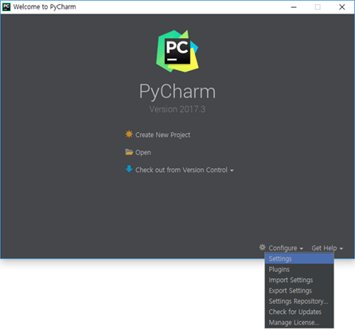
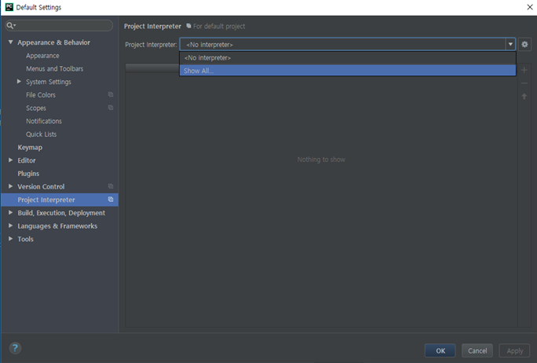
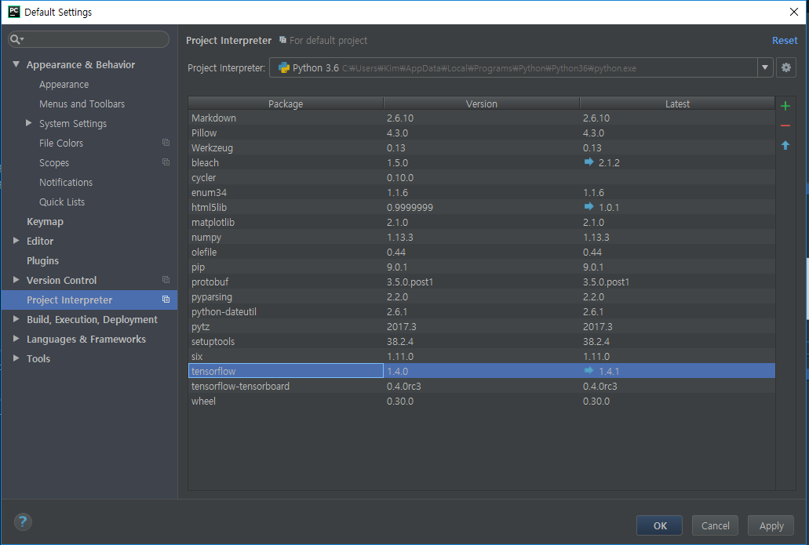

텐서플로(Tensorflow) 연습
========================

# Tensorflow 설치하기

1. Windows
- Python 3.6.x 설치: <https://www.python.org/downloads>
- Tensorflow 설치:
```
pip3 install --upgrade tensorflow       # CPU version
pip3 install --upgrade tensorflow-gpu   # GPU version
```
- 각종 라이브러리 설치
```
pip3 install numpy matplotlib pillow
```
- Pycharm 설치: <https://www.jetbrains.com/pycharm/>
- Pycharm 설정:
  1. Configure > settings

      
  2. Project Interpreter > show all

      
  3. System Interpreter > Python 경로 선택
  4. tensorflow 선택 후 확인 (시간이 걸림)

      
  5. Create New Project > Location 설정 > Existing Interpreter
  6. 새로운 파일 만들어서 아래 코드가 작동하는지 테스트
  ```
  import tensorflow as tf
  hello = tf.constant('Hello, TensorFlow!')
  sess = tf.Session()
  print(sess.run(hello))
  ```
