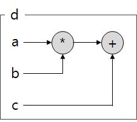
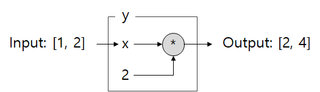
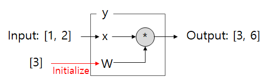

Tensorflow의 자료형
==================
상수형 (Constant)
----------------
- tf.constant(value, dtype=None, shape=None, name='Const', verify_shape=False)
  - value: 상수의 값
  - dtype: 데이터형 (e.g., tf.float32)
  - shape: tensor의 차원 (e.g., [3,3])
  - name: 상수의 이름

그래프 생성 및 세션
-----------------
```
import tensorflow as tf

a = tf.constant(5)
b = tf.constant(10)
c = tf.constant(20)

d = a*b+c

print(d)
```
```
실행 결과: Tensor("add:0", shape=(), dtype=int32)
```
- 실제로 `d=a*b+c`은 `a*b+c`라는 그래프를 d에 정의하는 과정이다.

  

- 그래프의 실행은 세션 (session) 객체를 통해 이루어지며, session 객체의 run 함수를 통해 이루어진다.
```
sess = tf.Session()
result = sess.run(d)
print(result)
sess.close()
```
```
실행 결과: 70
```

플레이스 홀더 (Placeholder)
---------------------------
- tf.placeholder(dtype, shape, name)
- 상수와 달리 임의의 연산을 갖는 그래프를 생성하고, 후에 session을 통해 다양한 값을 갖는 입력 및 출력을 얻는 다고 하자. 즉, 아래와 같은 그래프를 생성하고, 후에 다양한 입력으로 출력을 얻고 싶다고 하자.

  

  이를 구현하면 아래와 같다.
  ```
  import tensorflow as tf

  x = tf.placeholder(dtype=tf.float32)
  y = x * 2

  input_data = [1,2]

  sess = tf.Session()
  result = sess.run(y, feed_dict={x:input_data})
  print(result)
  sess.close()  
  ```
  ```
  실행 결과: [2., 4.]
  ```

변수형 (Variable)
-----------------
- 변수형 (Variable)은 연산을 위한 파라미터 변수이다. 딥러닝에서 학습하고자 하는 weight가 이에 해당한다.
- tf.Variable.\_\_init\_\_(initial_value=None, trainable=True, collections=None, validate_shape=True, caching_device=None, name=None, variable_def=None, dtype=None, expected_shape=None, import_scope=None)

  

- 선언만으로는 initial_value의 값이 Variable 객체에 입력되지 않으며, session 객체에서 initialize (global_variable_initializer 함수) 해주는 과정을 수행해야 붉은 화살표의 과정이 수행된다.

  ```
  import tensorflow as tf

  input_data = [1,2]
  x = tf.placeholder(dtype=tf.float32)
  W = tf.Variable([3],dtype=tf.float32)
  y = W*x

  sess = tf.Session()
  init = tf.global_variables_initializer()
  sess.run(init)
  result = sess.run(y,feed_dict={x:input_data})

  print result
  ```
  ```
  실행 결과: [ 3., 6.]
  ```

참고문헌:
--------
  1. <https://bcho.tistory.com/1150> (본 블로그의 내용을 따라하며 공부겸 요약)
